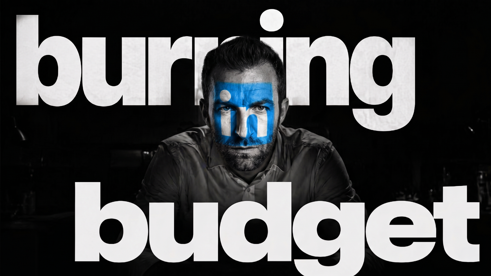

# LinkedIn Ads Kit

<p>
  
  
  
  
</p>

<p>
  
</p>

**An AI LinkedIn Ads manager that gives you a daily brief: what is real, what is fake, what is leaking, and what to do next.**

Built for Claude Code / OpenClaw-style agent workflows.

**Built by [Matt Berman](https://github.com/TheMattBerman) / [Emerald Digital](https://emerald.digital).**

---

*Read → Brief → Decide → Draft → Approve → Apply → Learn*

> **Builder Preview**
> Daily Brief, Export Mode, Connected Mode, safe drafts, guarded apply, multi-brand memory, and Thought Leader Ad fallback packets are live. LinkedIn API write access still depends on your approved Marketing API permissions.

Think: Meta Ads Kit for LinkedIn, but built for B2B buyer quality instead of cheap lead volume.

---

## What It Does

```text
┌──────────────┐   ┌──────────────┐   ┌──────────────┐   ┌──────────────┐
│     Read     │ → │    Brief     │ → │    Decide    │ → │    Draft     │
│ Exports/API  │   │ Real vs Fake │   │  Next Move   │   │  Reviewable  │
└──────────────┘   └──────────────┘   └──────────────┘   └──────┬───────┘
                                                                │
       ┌────────────────────────────────────────────────────────┘
       ↓
┌──────────────┐   ┌──────────────┐   ┌──────────────┐
│   Approve    │ → │    Apply     │ → │    Learn     │
│   Explicit   │   │  Reversible  │   │ learnings.md │
└──────────────┘   └──────────────┘   └──────────────┘
```

LinkedIn Ads Kit reads your LinkedIn Ads account, lead data, CRM notes, and brand context. Then it gives you the daily management brief you wish Ads Manager wrote for you.

Every brief answers:

1. **Are we buying real buyers?**
2. **What is creating fake confidence?**
3. **Where is the leak between ad, form, and sales?**
4. **What should we do next?**
5. **What should we avoid touching yet?**

You do not have to let the kit make changes. The daily brief is useful by itself.

If you do want action, the kit can turn recommendations into safe drafts, dry-run them, and apply only approved reversible changes.

Not another dashboard.
Not a generic audit checklist.
Not a bid automation toy.

**A daily LinkedIn Ads operator with memory and a seatbelt.**

---

## The 10-Second Mental Model

| Layer | Question |
|---|---|
| **Read** | What is actually in the account? |
| **Brief** | What is real, what is fake, what is leaking? |
| **Decide** | What is the next safe move? |
| **Draft** | Turn the decision into a reviewable action |
| **Approve** | You explicitly confirm before anything changes |
| **Apply** | Execute only reversible actions, with an audit trail |
| **Learn** | Compound what we know about this brand |

---

## Why This Exists

Most LinkedIn Ads teams do not have a cost-per-lead problem.

They have a **buyer-quality problem**.

The cheapest lead is often a student, vendor, tiny company, or "just researching" form fill.
The highest CTR post often pulls people who will never buy.
The campaign that looks efficient in LinkedIn can make sales roll their eyes.

And because LinkedIn is expensive, small mistakes get expensive fast:

- broad audiences that drift away from the buying committee
- lead forms that optimize for volume instead of fit
- offers that sound fine but do not create urgency
- company-page ads with no trust
- Thought Leader Ads launched because the post got likes, not because buyers cared
- sales teams getting leads with no context for the conversation the ad started

LinkedIn Ads Kit exists because you still need to run the account.

It helps you stop asking:

> "How do we get cheaper leads?"

And start asking:

> "Which paid signals are creating real buyer conversations?"

That is the difference between a LinkedIn Ads dashboard and a LinkedIn Ads business system.

---

## The Daily Brief

Start here.

```bash
npm run daily:brief -- --campaigns campaigns.csv --leads leads.csv --crm crm.csv
```

Or use the simpler alias:

```bash
npm run daily-check -- --campaigns campaigns.csv --leads leads.csv --crm crm.csv
```

Once Connected Mode is set up:

```bash
npm run daily:brief -- --brand acme
```

The daily brief is read-only by default. It tells you what to manage today:

| Section | What It Means |
|---------|---------------|
| **Real Signal** | Spend that appears to be creating qualified buyer conversations. |
| **Fake Signal** | Spend that looks fine in-platform but lacks buyer-quality evidence. |
| **Leaks** | Breaks between audience, offer, lead form, CRM, and sales handoff. |
| **Today's Moves** | Practical next actions: pause candidate, rewrite, inspect, score, or leave alone. |
| **Do Not Touch Yet** | Campaigns or decisions where the data is too thin for confident action. |
| **Data Gaps** | The exports, API permissions, or CRM notes needed for a better read. |

That is the management product:

```text
Most paid-ads tooling tracks winners, bleeders, fatigue, and budget shifts.
LinkedIn Ads Kit tracks real buyers, fake signal, sales leaks, and the next safest move.
```

---

## Inside The Loop

The 10-Second Mental Model above is the scan view. Here is what each layer actually does on a real run:

| Layer | What Happens |
|-------|--------------|
| **Read** | Ingest LinkedIn exports or pull live account data through the LinkedIn Marketing API. |
| **Brief** | Explain real signal, fake signal, leaks, today's moves, do-not-touch-yet items, and data gaps. |
| **Decide** | Use the brief to manage the account even if you never allow live writes. |
| **Draft** | Turn recommendations into reviewable markdown drafts with machine-readable action blocks. |
| **Approve** | You review the recommendation before anything touches the account. |
| **Apply** | Safe reversible actions only: pause, budget update, activate approved drafts, or create supported Thought Leader creative drafts. |
| **Learn** | Append durable findings to brand memory so the kit gets smarter every run. |

Every live write has:

- preflight validation
- explicit confirmation
- current-value checks
- brand/account guardrails
- audit trail
- rollback notes

---

## Two Ways To Run It

### Export Mode

Zero API setup. Use LinkedIn Ads exports, lead form exports, and CRM CSVs.

```bash
npm run export:brief -- --campaigns campaigns.csv --leads leads.csv --crm crm.csv
```

Good for:

- one-off audits
- client accounts without API access
- early exploration before connecting anything
- sharing the kit publicly without requiring LinkedIn app approval

Lead form CSVs are intentionally flexible. LinkedIn lets teams rename fields per form, so the kit maps common aliases and preserves unmapped columns as custom questions or hidden fields instead of assuming one official export schema.

### Connected Mode

OAuth into LinkedIn Marketing APIs and let the kit pull account data directly.

```bash
npm run auth
npm run daily:brief -- --brand acme
npm run connected:brief -- --brand acme
```

Good for:

- recurring daily account reads
- safer draft generation from current values
- account discovery
- campaign, creative, reporting, and lead-form checks
- apply workflows with verification

Lead Sync is separately gated by LinkedIn. If you do not have that permission, the kit keeps going and tells you exactly what lead data to export manually.

---

## A Typical Morning

```text
LINKEDIN ADS KIT - DAILY BRIEF
Brand: Acme
Source: Connected Mode
Confidence: MEDIUM

REAL SIGNAL
- CFO pain Thought Leader test
  - $650 spend
  - 12 leads
  - 3 opportunity-stage CRM matches
  - comments from actual finance leaders

FAKE SIGNAL
- Generic demo campaign
  - $2,400 spend
  - 0 qualified leads
  - weak CTR
  - sales notes: "bad fit / no urgency"

LEAK
- Founder POV ads → generic product form
  - good engagement
  - form does not ask company size or buying role
  - sales cannot tell why the lead converted

NEXT 3 MOVES
1. Pause Generic Demo after dry run
2. Add one qualification question to the form
3. Turn the CFO pain post into a Thought Leader Ad test

DO NOT TOUCH YET
- Do not cut the CFO pain campaign just because CPL is higher
- Do not scale the generic demo campaign until sales quality improves
```

That is the product.

Not "your CTR went up 12%."

What is real. What is fake. What to do next.

---

## Quick Start

```bash
git clone https://github.com/TheMattBerman/linkedin-ads-kit.git
cd linkedin-ads-kit
./install.sh
```

Or install manually:

```bash
npm install
npm run brand:init
```

Run the full demo path (recommended first step):

```bash
npm run demo
```

The demo seeds the `exampleco` brand workspace and writes briefs and a safe draft there. Happy-path outputs land in:

```text
workspace/brands/exampleco/linkedin/briefs/
workspace/brands/exampleco/linkedin/drafts/
```

Once you have your own brand slug, run the example daily brief:

```bash
npm run daily:brief -- --brand acme --campaigns examples/exports/linkedin-campaigns.csv --leads examples/exports/linkedin-leads.csv --crm examples/exports/crm-leads.csv
```

Run the deeper export brief with safe draft candidates:

```bash
npm run export:brief -- --brand acme --campaigns examples/exports/linkedin-campaigns.csv --leads examples/exports/linkedin-leads.csv --crm examples/exports/crm-leads.csv
```

Named-brand mode is the recommended happy path because it scales to multiple clients and matches the demo. Drop the `--brand` flag for single-brand mode — see [Multi-Brand Memory](#multi-brand-memory).

See [DEMO-WORKFLOW.md](DEMO-WORKFLOW.md) for the guided walkthrough, [OPERATOR-PLAYBOOK.md](OPERATOR-PLAYBOOK.md) for the buyer-quality framework behind the kit, and [RELEASE-BUNDLE.md](RELEASE-BUNDLE.md) for giveaway packaging.

---

## Multi-Brand Memory

This kit is built for operators who manage more than one brand.

Single-brand mode:

```bash
npm run brand:init
npm run daily:brief -- --campaigns examples/exports/linkedin-campaigns.csv
```

Named brand mode:

```bash
npm run brand:init -- --brand acme
npm run daily:brief -- --brand acme --campaigns examples/exports/linkedin-campaigns.csv
```

Each brand gets its own memory:

```text
workspace/brands/acme/
├── profile.md
├── audience.md
├── voice-profile.md
├── offer.md
├── stack.json
├── learnings.md
└── linkedin/
    ├── account.md
    ├── briefs/
    ├── drafts/
    ├── audit-trail/
    └── cache/
```

The important file is `learnings.md`.

Every brief and apply run can compound what the kit knows about the brand: who converts, what sales rejects, which offers create quality, which Thought Leader voices deserve spend, and what not to repeat.

---

## Connected Setup

Connected Mode requires LinkedIn Marketing Developer Platform access. This is an application program and approval can take weeks. Read the [Getting LinkedIn API Access](SETUP.md#getting-linkedin-api-access) section in SETUP.md before you assume you can run `npm run auth` today.

Once you have an approved app, copy the env template:

```bash
cp .env.example .env
```

Fill in:

```text
LINKEDIN_CLIENT_ID=
LINKEDIN_CLIENT_SECRET=
LINKEDIN_REDIRECT_URI=http://localhost:3000/oauth/linkedin/callback
LINKEDIN_API_VERSION=202604
```

Generate the OAuth URL:

```bash
npm run auth
```

Exchange the returned code:

```bash
npm run auth -- --code YOUR_RETURNED_CODE
```

Run the health check:

```bash
npm run doctor
```

Pull a connected brief:

```bash
npm run connected:brief -- --brand acme
```

---

## Safe Apply

LinkedIn Ads Kit does not freehand your ad account.

Every apply starts as a draft:

```bash
npm run draft -- --brand acme --action pause-campaign \
  --target urn:li:sponsoredCampaign:123 \
  --current ACTIVE \
  --reason "Spend without buyer-quality signal"
```

Dry run it:

```bash
npm run apply -- --brand acme --draft workspace/brands/acme/linkedin/drafts/YOUR_DRAFT.md --dry-run
```

The draft must live under the resolved brand's `linkedin/drafts/` folder, and its ad account URN must match the selected account recorded for that brand. The dry run writes a signed receipt next to the draft; live apply refuses stale, edited, forged, or foreign-workspace drafts.

Apply only with explicit confirmation:

```bash
npm run apply -- --brand acme --draft workspace/brands/acme/linkedin/drafts/YOUR_DRAFT.md --confirm APPLY
```

Single-brand mode drafts land under `workspace/brand/linkedin/drafts/` (see [Multi-Brand Memory](#multi-brand-memory)).

V1 supports:

| Action | Status | Safety Model |
|--------|--------|--------------|
| Pause campaign | Live | Current-value check + audit trail |
| Pause creative | Live | Current-value check + audit trail |
| Set campaign daily budget | Live | LinkedIn budget object shape + audit trail |
| Activate approved draft creative | Live | Intended-status check + audit trail |
| Create Thought Leader creative draft | Best effort | Falls back to Campaign Manager launch packet |

Still excluded:

- deleting entities
- broad campaign creation
- bid strategy changes
- audience expansion changes
- blind campaign rebuilds
- anything without brand/account validation

---

## Thought Leader Ads

Thought Leader Ads are the sharp edge of this kit.

The trap is obvious: teams sponsor posts because they got engagement.

That is not enough.

This kit scores candidate posts on:

| Signal | Question |
|--------|----------|
| ICP fit | Is the right buying committee likely to care? |
| Buyer pain | Does it name an expensive problem? |
| Trust | Does it sound like lived experience, not brand copy? |
| Organic signal | Did the market react before paid spend? |
| Offer fit | Does it connect to a real next step? |
| Sales usefulness | Would sales be glad this conversation started? |

If API creation is available, the kit drafts the creative action.

If LinkedIn permissions or approval mechanics block API creation, it produces a Campaign Manager launch packet:

- post URL
- objective and format notes
- approval request copy
- budget test
- UTM
- measurement notes
- what to watch before scaling

---

## Skills

| Skill | What It Does |
|-------|--------------|
| `linkedin-ads` | Core operator workflow: load brand memory, inspect data, produce the brief |
| `linkedin-api-connect` | OAuth, account discovery, API health, connected pulls |
| `linkedin-ads-apply` | Safe draft review, dry run, apply, audit trail |
| `buyer-quality-audit` | Separates real buyer signal from fake lead volume |
| `lead-quality-mapper` | Maps lead and CRM records into fit, intent, and sales-readiness |
| `offer-angle-diagnoser` | Finds whether the offer is strong enough for LinkedIn traffic |
| `thought-leader-ad-selector` | Scores posts and builds API or Campaign Manager launch paths |
| `form-friction-review` | Reviews lead forms for conversion friction and qualification quality |
| `pipeline-brief-writer` | Turns findings into an executive-ready operator brief |
| `sales-handoff` | Creates sales context from campaign, offer, form, and lead data |

---

## Commands

**Setup**

| Command | What It Does |
|---------|--------------|
| `npm run brand:init` | Create default brand memory |
| `npm run brand:init -- --brand acme` | Create named brand memory |
| `npm run auth` | Generate LinkedIn OAuth URL or exchange an OAuth code |

**Brief**

| Command | What It Does |
|---------|--------------|
| `npm run daily:brief` | Build the read-only daily LinkedIn Ads management brief |
| `npm run daily-check` | Alias for the daily brief workflow |
| `npm run export:brief` | Build a brief from CSV exports |
| `npm run connected:brief` | Build a brief from LinkedIn API data |

**Draft & Apply**

| Command | What It Does |
|---------|--------------|
| `npm run draft` | Create a safe action draft |
| `npm run apply` | Dry run or apply an approved draft |

**Utility**

| Command | What It Does |
|---------|--------------|
| `npm run demo` | Seed ExampleCo, run export mode, and write a demo brief/draft |
| `npm run doctor` | Check env, brand files, token, and API account access |
| `npm test` | Run the test suite |

---

## Project Structure

```text
linkedin-ads-kit/
├── README.md
├── CLAUDE.md
├── AGENTS.md
├── SOUL.md
├── SETUP.md
├── DEMO-WORKFLOW.md
├── OPERATOR-PLAYBOOK.md
├── RELEASE-BUNDLE.md
├── .env.example
├── .gitignore
├── install.sh
├── package.json
├── bin/
│   └── linkedin-ads-kit.js
├── src/
│   ├── cli.js
│   ├── brief.js
│   ├── draft.js
│   ├── apply.js
│   ├── connected.js
│   ├── workspace.js
│   ├── thoughtLeaderAds.js
│   └── linkedin/
├── skills/
├── examples/
├── test/
├── workspace-template/           # scaffold copied on brand:init
└── workspace/                    # your runtime brand memory (gitignored)
    ├── brand/                    # default single-brand mode
    └── brands/<slug>/            # named multi-brand mode (recommended)
```

---

## Cost

| Tool | Monthly Cost |
|------|--------------|
| LinkedIn Marketing API | Free, requires approved access |
| Export Mode | Free |
| Node CLI | Free |
| Claude Code / OpenClaw-style agent | Depends on your agent host |

Your LinkedIn ad spend is separate. This kit just helps you stop wasting it on the wrong signals.

---

## Honest Limitations

- **LinkedIn Marketing API access is not guaranteed.** Approval can take weeks and LinkedIn declines applications regularly. Export Mode is the way in while you wait — and for any client you manage who cannot grant API access at all.
- **Lead Sync is separately gated.** If LinkedIn denies Lead Sync permission, the kit keeps running and tells you exactly which lead data to export manually.
- **Thought Leader Ad creation via API is best-effort.** When LinkedIn permissions or approval flows block it, the kit falls back to a Campaign Manager launch packet instead of pretending it worked.
- **Brief quality depends on honest inputs.** A vague `profile.md`, thin `offer.md`, or empty `learnings.md` will produce a vague brief. Strong brand memory and real sales notes compound the read.
- **This is not a bid automation tool.** It does not adjust bids, expand audiences automatically, or rebuild campaigns from scratch. It helps you decide. You still run the account.

---

## Need A Custom Version?

If you want this kit adapted to your team, brand, or LinkedIn Ads setup, you can [book a call](https://superhuman.com/book/11SzDMc4iBJQ4mgyrW/8nyzX).

If you want updates on how these operator systems evolve, subscribe to the [Big Players newsletter](https://bigplayers.co/subscribe).

## Contributing

This kit is still evolving.

If you improve:

- the buyer-quality read
- the Thought Leader Ad scoring
- the Safe Apply model
- the export-mode or connected-mode workflows
- the brand memory format

that makes the whole kit better. PRs welcome.

---

## The Principle

This kit is not Meta Ads with more expensive clicks.

LinkedIn is a trust and buyer-quality channel.

When it works, it is because the right person sees the right point of view from a credible source, takes a next step that filters for fit, and sales knows exactly what conversation to continue.

That is what this kit is built to run.
